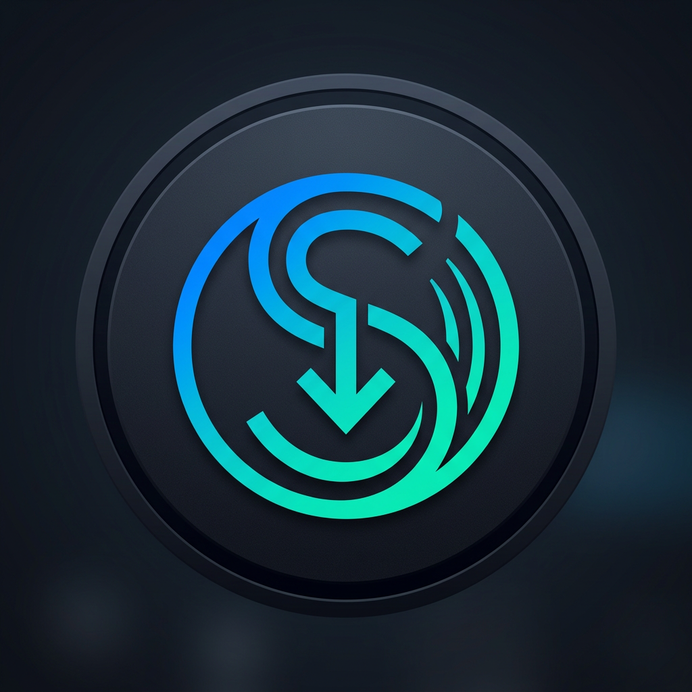

# SERENA

[](Dockerfile)
[](render.yaml)
[](https://www.python.org/)
[](LICENSE)
[](https://t.me/serenaunzipbot)
[](https://t.me/TechnicalSerena)



**SERENA** is a production-ready, high-performance Telegram media downloader built with **PyroTGFork**, **MongoDB**, **FFmpeg**, and the Arc media API. It supports search, media link extraction, inline mode, managed clone bots, Docker containers, and Render Web Services with serverless-style webhook auto-wake.

The repository includes a unified HTTP health and webhook server for Render Free plan wake-on-request, Docker Compose for local development, multi-key API failover, backwards compatibility for `python -m bot`, and a modern SERENA brand asset.

> **Important:** `API_URL=https://api.arcmusic.fun` is the external media API dependency used by this code. You need an active Arc API plan and at least one valid API key.

| Runtime | Deployment | Storage | Media engine | Health & Webhook |
|---|---|---|---|---|
| Python 3.12+ / PyroTGFork | Docker / Render Web Service | MongoDB Atlas | FFmpeg | `/health`, `/wake`, `/telegram/webhook` |

<details>
<summary><strong>Table of contents</strong></summary>

- [Features](#features)
- [Repository structure](#repository-structure)
- [Render Free Webhook & Auto-Wake](#render-free-webhook--auto-wake)
- [Clone Bot Deep Link Flow](#clone-bot-deep-link-flow)
- [Credentials](#credentials-where-to-get-each-value)
- [Arc API key setup](#arc-api-key-setup)
- [Free plan limitations](#free-arc-api-plan-limitations)
- [Multiple API keys](#multiple-api-keys-and-automatic-failover)
- [Local setup](#environment-setup)
- [Docker Compose](#run-with-docker-compose)
- [Render deployment](#deploy-on-render-as-a-web-service)
- [Documentation & Guides](#documentation--guides)
- [Credits and branding](#serena-credits-and-branding)

</details>

## Features

| Area | Included |
|---|---|
| **Media Extraction** | YouTube search/tracks/playlists, Spotify, SoundCloud, Apple Music, JioSaavn, Instagram, Facebook, Threads, TikTok, Twitter/X, Bluesky, Pinterest, Reddit, and Terabox |
| **Delivery** | Telegram private chats, groups, inline mode, playlists, media groups, album thumbnails, and FFmpeg transcoding |
| **Render Webhook Wake** | Automatic Telegram Bot API webhook registration (`POST /telegram/webhook`); wakes sleeping Render Free instances on incoming user message without external monitors |
| **Clone Bots** | Reliable managed-bot deep link flow (`https://t.me/newbot/...`), automatic token export, SERENA branding application, and `/mybot` manager |
| **Operations** | MongoDB-backed users & clone registry, admin stats/broadcast tools, multi-language preferences (`en`, `es`, `my`, `ru`), and ephemeral download cleanup |
| **Reliability** | Arc API multi-key rotation/failover (`401`/`403`/`429` fallback), auto-retries, job polling, and graceful exception handling |
| **Deployment** | Docker, Docker Compose, Render Blueprint (`render.yaml`), `/health`, `/healthz`, `/wake` endpoints, and `python -m bot` backwards compatibility |
| **Branding** | Modern circular teal/blue SERENA logo icon, `@TechnicalSerena` maintainer credit, and `@serenaunzipbot` updates channel |

---

## Repository structure

```text
.
├── bot.py                # Backward compatibility entrypoint (python -m bot)
├── Dockerfile            # Multi-stage optimized container image
├── docker-compose.yml    # Local development with bundled MongoDB
├── render.yaml           # Render Web Service Blueprint
├── requirements.txt      # Production Python dependencies
├── .env.example          # Environment variables template
├── docs/                 # Detailed operational guides
│   ├── architecture.md   # Architecture & internal module design
│   ├── botfather.md      # BotFather management & deep link clone guide
│   └── render.md         # Render Free Web Service & Webhook setup guide
└── serena/               # Clean modular package
    ├── assets/           # SERENA brand logo & static assets
    ├── core/             # Config, Telegram client, MongoDB, clones, health server
    ├── dl/               # Arc API client, download engines, FFmpeg, Terabox
    ├── handlers/         # Message, callback, inline, clones, admin handlers
    ├── local/            # Internationalization JSON catalogs (en, es, my, ru)
    └── utils/            # Keyboard builder, classifier, caches, helpers
```

---

## Render Free Webhook & Auto-Wake

On Render's Free tier, web services sleep after 15 minutes of inactivity. SERENA solves this natively:

1. On startup, SERENA auto-registers its webhook URL with Telegram Bot API:
   `https://YOUR-SERVICE.onrender.com/telegram/webhook`
2. When a user sends a message or interaction in Telegram, Telegram sends an HTTP `POST` to Render.
3. Render receives the HTTP request and **automatically wakes up the sleeping container**.
4. The service initializes within ~45–60s (cold start) and processes user requests seamlessly.
5. **No external monitoring services** (such as UptimeRobot or Better Stack) are required!

Available HTTP endpoints:
- `POST /telegram/webhook` — Telegram update receiver (supports optional `WEBHOOK_SECRET` verification)
- `GET /health` and `GET /healthz` — Service health probe
- `GET /wake` — Explicit wake ping endpoint
- `GET /` — Service info and status overview

---

## Clone Bot Deep Link Flow

SERENA uses Telegram's official managed-bot creation deep link:

```text
https://t.me/newbot/<MANAGER_USERNAME>/<SUGGESTED_USERNAME>?name=<SUGGESTED_NAME>
```

- **Reliability:** Universal inline button supported across all Telegram mobile, desktop, and web clients.
- **Workflow:** Tapping **🤖 Clone this bot** opens BotFather directly with suggested username and name pre-filled.
- **Automated Lifecycle:** Once created, Telegram notifies SERENA via `ManagedBotUpdated`. SERENA exports the bot token, sets the avatar and bot descriptions, and launches the clone bot in memory.
- **Management:** Users can start, stop, or delete their cloned bots anytime with `/mybot`.
- **Safety:** If Bot Management Mode is not enabled in BotFather, SERENA detects `can_manage_bots == False` and hides the clone button to prevent client errors.

---

## Credentials: where to get each value

Never commit `.env`, bot tokens, API hashes, API keys, or database passwords to GitHub. Set them as Render environment variables or keep them in your local `.env` file.

| Variable | Required | Where it comes from |
|---|---:|---|
| `API_ID` | Yes | Telegram API development tools: [my.telegram.org/auth?to=apps](https://my.telegram.org/auth?to=apps) |
| `API_HASH` | Yes | Created beside `API_ID` in Telegram API development tools: [my.telegram.org/auth?to=apps](https://my.telegram.org/auth?to=apps) |
| `BOT_TOKEN` | Yes | Create/manage the bot through Telegram's official [@BotFather](https://t.me/BotFather) |
| `API_URL` | Yes | Existing media API endpoint: [api.arcmusic.fun](https://api.arcmusic.fun). Keep it unchanged unless you have a compatible replacement. |
| `API_KEY` | One of these | Single-key compatibility option. Create an account at the [Arc API portal](https://portal.arcmusic.fun/register), choose a plan at [Plans](https://portal.arcmusic.fun/plans), then copy the key from [Usage](https://portal.arcmusic.fun/usage). |
| `API_KEYS` | Recommended | Comma-separated backup keys (e.g. `key_one,key_two,key_three`). SERENA fails over automatically on `401`/`403`/`429` or transport errors. |
| `MONGO_URI` | Yes | Create a MongoDB database at [MongoDB Atlas](https://www.mongodb.com/atlas/database), then copy its connection string. |
| `MONGO_DB` | No | Database name (default: `serena`). |
| `OWNER_ID` | Yes | Your numeric Telegram user ID from [@userinfobot](https://t.me/userinfobot). |
| `SUDO_USERS` | Yes | Comma-separated numeric Telegram user IDs allowed to use admin commands (`/stats`, `/broadcast`). `OWNER_ID` is added automatically. |
| `UPDATES_CHANNEL_URL` | Optional | SERENA updates channel (default: `https://t.me/serenaunzipbot`). |
| `WEBHOOK_PATH` | Optional | Webhook route path (default: `/telegram/webhook`). |
| `WEBHOOK_SECRET` | Optional | Secret token for validating `X-Telegram-Bot-Api-Secret-Token`. |
| `WEBHOOK_URL` | Optional | Explicit full webhook URL (if omitted, `RENDER_EXTERNAL_URL` is used on Render). |
| `APP_NAME` | Optional | Application title (default: `SERENA`). |
| `HOST` / `PORT` | Managed | Local defaults are `0.0.0.0` and `10000`. Render injects `PORT` automatically. |

---

## Arc API key setup

1. Open the [Create account page](https://portal.arcmusic.fun/register).
2. Register and sign in at the [Arc API login page](https://portal.arcmusic.fun/login).
3. Open [Plans](https://portal.arcmusic.fun/plans) and select an active plan.
4. Open the [Usage page](https://portal.arcmusic.fun/usage) and copy your API key.
5. Add it to Render / `.env` as `API_KEY` or `API_KEYS`.

### Free Arc API plan limitations

- Plans include daily total request and video download quotas that reset at **midnight UTC**.
- `429 Too Many Requests` indicates daily limits reached; configuring multiple keys in `API_KEYS` provides immediate failover.
- `403 Forbidden` indicates an invalid or expired plan key.

---

## Environment setup

Create a local environment file from the template:

```bash
cp .env.example .env
```

Fill in your credentials. `.env` is ignored by Git.

For local Docker Compose, keep:
```env
MONGO_URI=mongodb://mongo:27017/serena
MONGO_DB=serena
```

For Render, replace `MONGO_URI` with your MongoDB Atlas `mongodb+srv://...` connection string.

---

## Run locally with Python

Python 3.12+ is recommended:

```bash
python -m venv .venv

# Linux / macOS
source .venv/bin/activate

# Windows
# .venv\Scripts\activate

pip install --upgrade pip
pip install -r requirements.txt
python -m bot
```

Test the local health endpoint at `http://localhost:10000/health`.

---

## Run with Docker Compose

```bash
cp .env.example .env
docker compose up --build
```

Test health:
```bash
curl http://localhost:10000/health
```

---

## Deploy on Render as a Web Service

### Option A: Render Blueprint (One-Click)

1. Push this repository to GitHub.
2. In [Render Dashboard](https://dashboard.render.com/), click **New + → Blueprint**.
3. Select your repository.
4. Fill in the `sync: false` environment secrets.
5. Render deploys SERENA as a Docker Web Service on the Free plan.

### Option B: Manual Web Service

1. In Render Dashboard, click **New + → Web Service**.
2. Connect your repository.
3. Choose **Docker** runtime.
4. Set **Health Check Path** to `/health`.
5. Under **Environment**, configure all required variables (`API_ID`, `API_HASH`, `BOT_TOKEN`, `API_KEYS`, `MONGO_URI`, `OWNER_ID`, `SUDO_USERS`).
6. Deploy the service.

---

## Documentation & Guides

- 📘 [Architecture & Internals](docs/architecture.md) — Comprehensive deep dive into SERENA's module design and event flow.
- 🚀 [Render Free Webhook Deployment](docs/render.md) — Step-by-step setup, auto-wake behavior, and troubleshooting.
- 🤖 [BotFather & Clone Setup Guide](docs/botfather.md) — Enabling Bot Management Mode, `/setinline`, `/setinlinefeedback`, and `/empty` menu reset.

---

## Credits and branding

- Maintainer credit: [@TechnicalSerena](https://t.me/TechnicalSerena)
- Official updates channel: [@serenaunzipbot](https://t.me/serenaunzipbot)
- The SERENA logo in `serena/assets/serena_logo.png` is an original circular brand asset optimized for Telegram avatars.
- License: [MIT](LICENSE)
